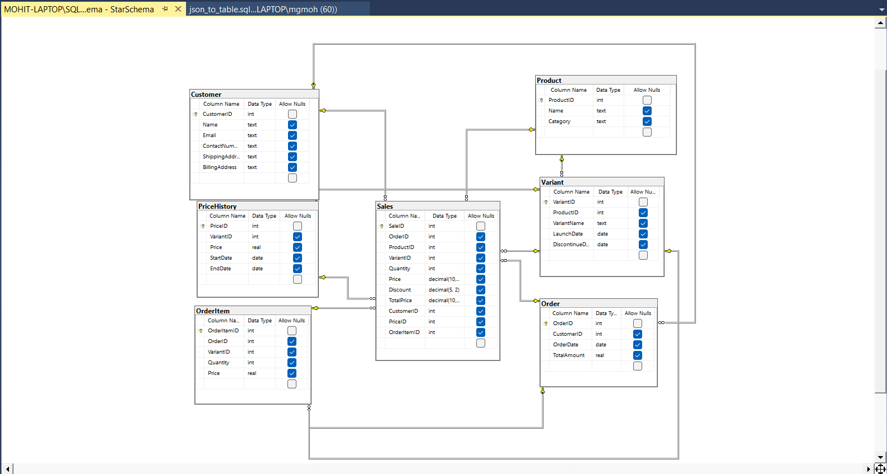
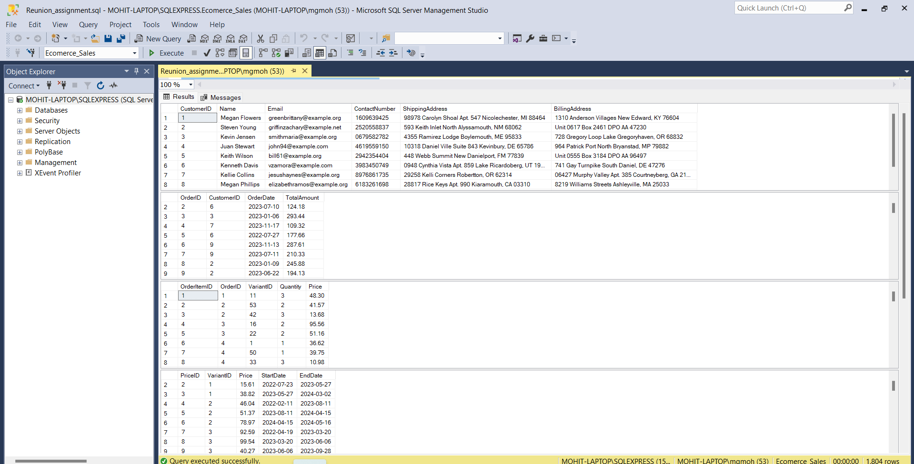
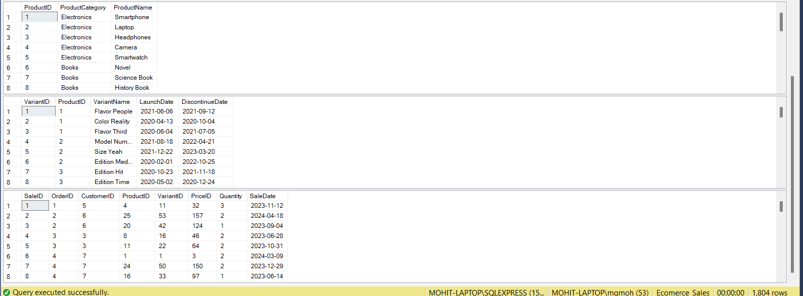
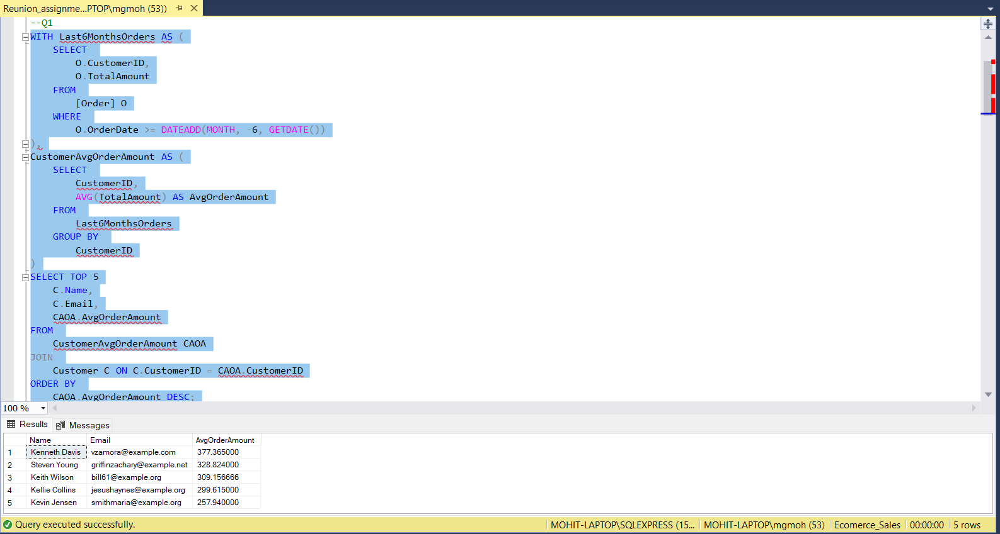
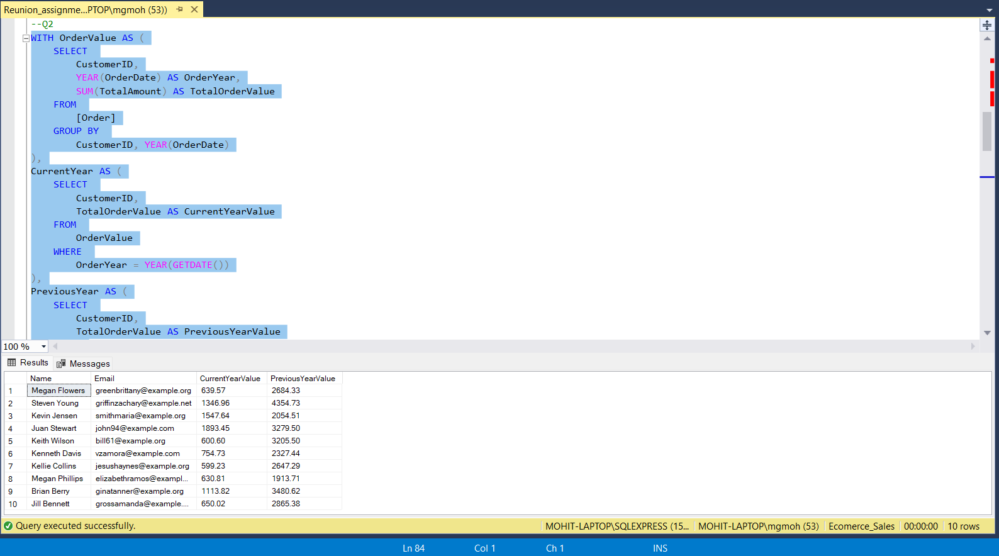
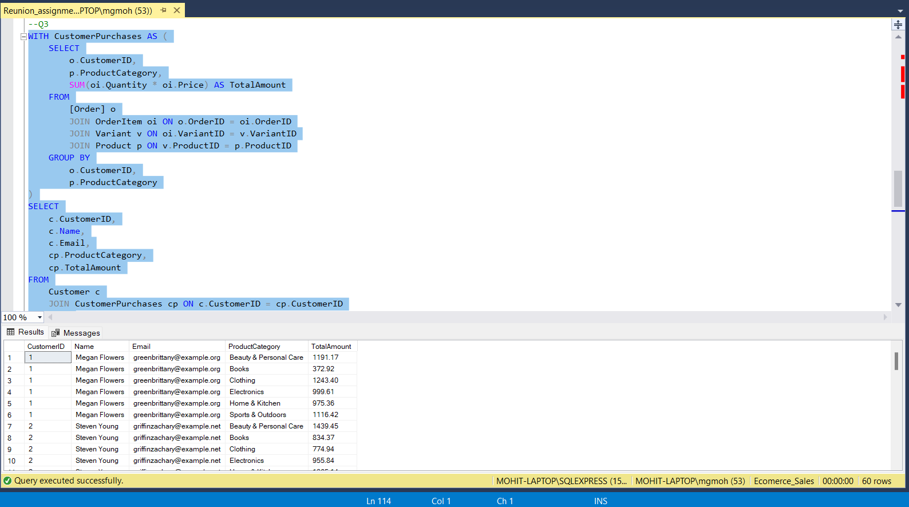
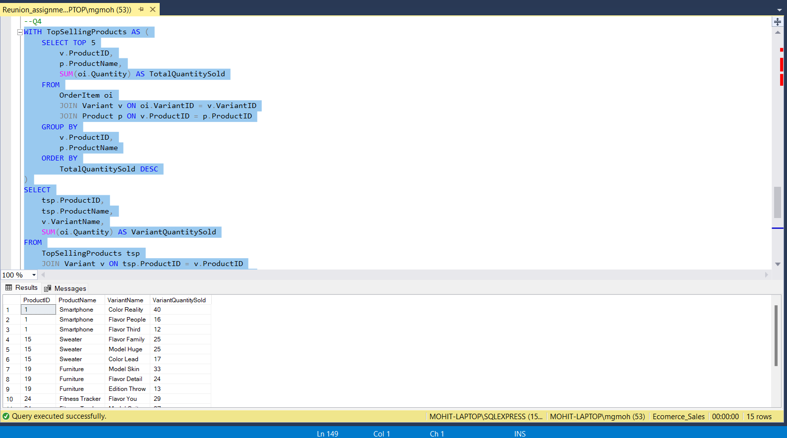
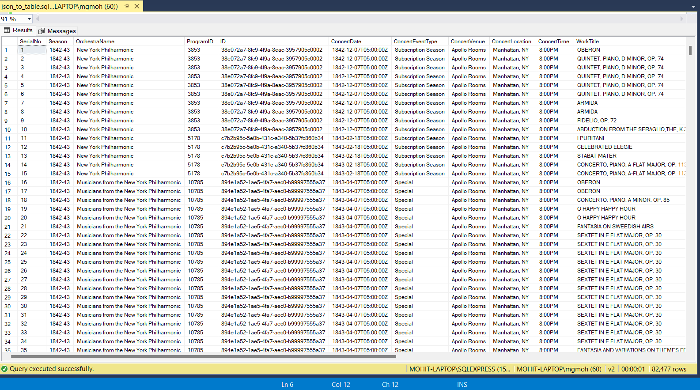

# Reunion-Assignment

## Problem 1 Solution
Steps:
1. First create the Database named 'Ecomerce_Sales' in the Microsoft SSMS application.
2. Then download the Database_Creation.py file and the change the server, database and username fo SSMS studio credentials in the Database_Creation.py file.
3. Then run the file using terminal in VS Code using python script - python <path-to-Database_Creation.py-file>.
4. Database gets created now.

## Database Struature (ER Diagram)

### Database Tables Images

## Problem 2 Solution
Steps:
1. Open Reunion_Assignment.sql file in the SSMS SQL application.
2. Run the SQL Scripts now and get the outputs.
### Query 1

### Query 2

### Query 3

### Query 4

## Problem 3 Solution  -- Partially Solved
Steps:
1. Open json_to_table.sql file in the SSMS SQL application.
2. Run the SQL Scripts now and get the outputs as shown in image.
### Data Table

in this repo python file and notebook file both are added.

